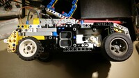

Frankencar
==========

Frankencar is a one-off LEGO-built MCU-controlled toy car. It uses motors
salvaged from old multi-functional printers, a custom buck converter, an
STM32, and a few driving parts. It's mostly a learning exercise for the
author.

  

 

 

